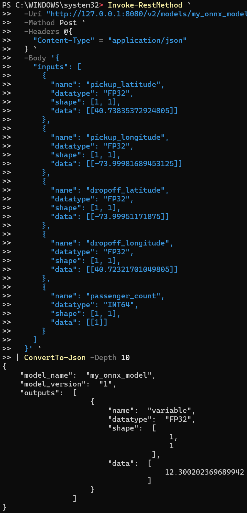
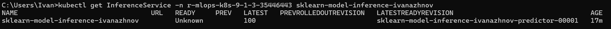
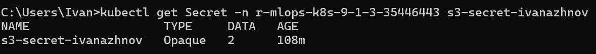
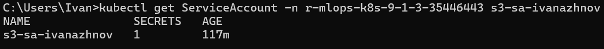

# Module 8 Сервис рекомендации цен на поездку такси.

## Структура проекта
```bash
├── src - сервис для запуска API и обучения модели
├── kubernetes - манифесты
```

## Быстрый старт

- **Требования**: Python 3.12 (см. `.python-version`), macOS/zsh
- **Путь проекта**: `<path_to_project>`

### 1) Установка окружения
```bash
cd <path_to_project>
uv pip install -r requirements.txt --python .venv
```

### 2) Обучение модели
Модель будет сохранена в src/service/artifacts/model.pkl
```bash
cd <path_to_project>/src/service/
uv run train_and_save_model.py
```

### 3) Конвертация модели
Модель будет сохранена в src/service/artifacts/onnx.pkl
```bash
cd src/service/
uv run train_and_save_model.py
```

### 4) Базовый тест производительности
Результаты будут сохранены в src/service/artifacts/profile_onnx_IvanAzhnov.json
```bash
cd src/service/
uv run onnx_benchmark.py
```

### 5) Копируем в s3
```bash
aws s3 cp "<path_to_project>\src\service\artifacts\model.onnx" s3://r-mlops-bucket-9-1-3-35446443/model_dir/my_onnx_model/1/model.onnx --endpoint-url=https://storage.yandexcloud.net
```

### 6) Поднимаем сервис
```bash
cd kubernetes
kubectl apply -f s3-secret-ivanazhnov.yaml -f s3-sa-ivanazhnov.yaml -f sklearn-model-inference-ivanazhnov.yaml
```


### 7) Пробрасываем сервис на локалхост:
```powershell
$ISVC="sklearn-model-inference-ivanazhnov"; kubectl -n r-mlops-k8s-9-1-3-35446443 get pods -l "serving.knative.dev/service=$($ISVC)-predictor" --field-selector=status.phase=Running -o jsonpath="{.items[0].metadata.name}"
kubectl -n r-mlops-k8s-9-1-3-35446443 port-forward pod/$POD_NAME 8080:8080
```

### Пример запроса Windows PowerShell
```powershell
Invoke-RestMethod `
  -Uri "http://127.0.0.1:8080/v2/models/my_onnx_model/infer" `
  -Method Post `
  -Headers @{
    "Content-Type" = "application/json"
  } `
  -Body '{
    "inputs": [
      {
        "name": "pickup_latitude",
        "datatype": "FP32",
        "shape": [1, 1],
        "data": [[40.73835372924805]]
      },
      {
        "name": "pickup_longitude",
        "datatype": "FP32",
        "shape": [1, 1],
        "data": [[-73.99981689453125]]
      },
      {
        "name": "dropoff_latitude",
        "datatype": "FP32",
        "shape": [1, 1],
        "data": [[-73.99951171875]]
      },
      {
        "name": "dropoff_longitude",
        "datatype": "FP32",
        "shape": [1, 1],
        "data": [[40.72321701049805]]
      },
      {
        "name": "passenger_count",
        "datatype": "INT64",
        "shape": [1, 1],
        "data": [[1]]
      }
    ]
  }' `
| ConvertTo-Json -Depth 10
```



### Статус сервиса



